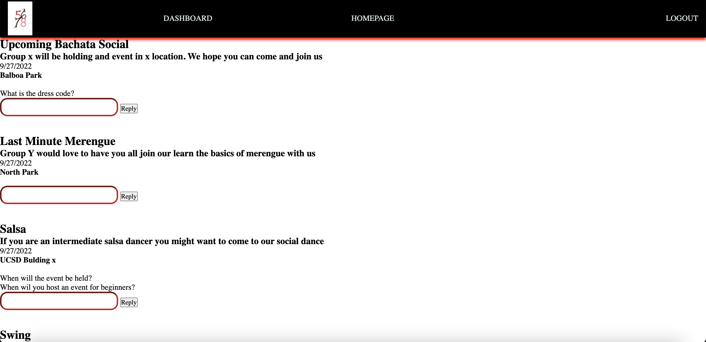
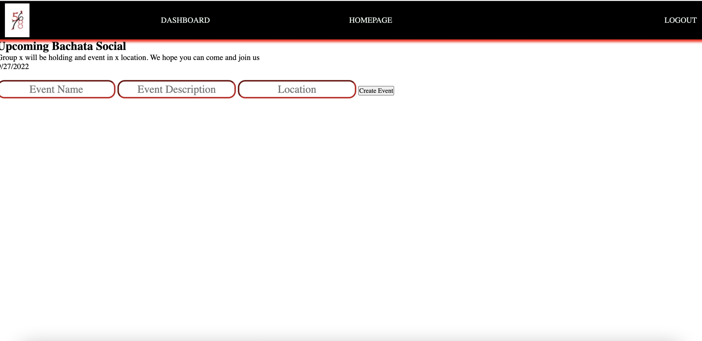

# Project-too

This is a convenient app that allows dance groups to share upcoming social events they're holding and helps people interested in dance events find them and sign up according to their individual preferences. The app displays different socials in the user's area and gives information such as the type of event and dance involved, the date the event is being held, and the location. 

## User Story

As a dance group I want to be able to post upcoming events on the main page, update posts, delete events, and see the people who will be attending. 

As a user I want to be able to create a user account, see upcoming events on the main page, comment on event posts, and sign up for the events I'm interested in. 

## Screenshots

## Deployed Link 

The application can be found at the following link:

[Deployed-link] (https://github.com/nbwong1/IFP-projekt-commrade)

